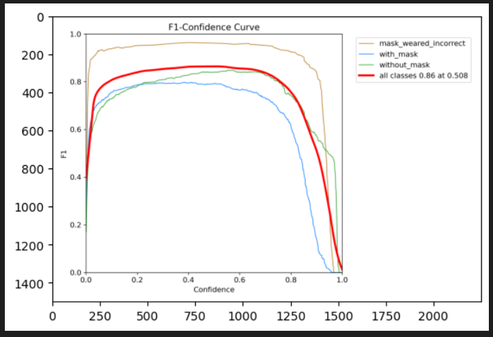
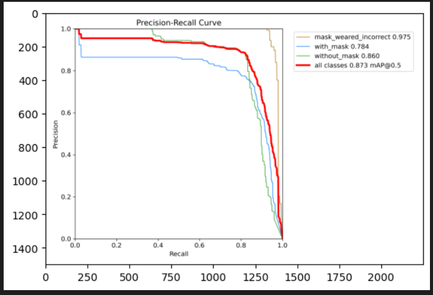
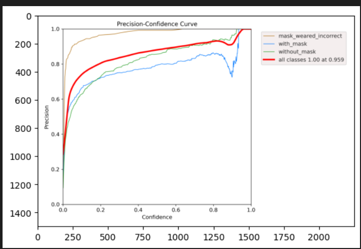
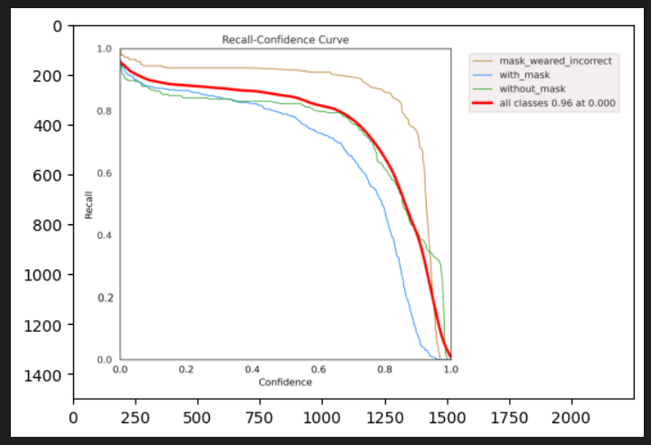
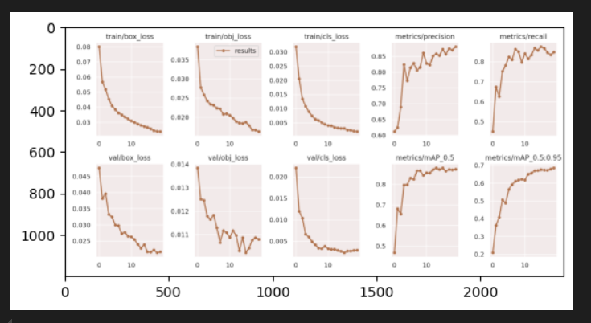

# Face Mask Detection Project

This project implements a Real-Time face mask detection system using the YOLOv5 object detection model. The system is trained to detect whether individuals in images are wearing face masks , wearing mask incorrectly or not wearing a mask.

## Table of Contents
- [Overview](#overview)
- [Technologies Used](#technologies-used)
- [Dataset](#dataset)
- [Model Training](#model-training)
- [Results](#results)
- [Setup and Usage](#setup-and-usage)
- [Acknowledgments](#acknowledgments)

## Overview

The goal of this project is to create a robust face mask detection system that can be used in real-world scenarios, such as monitoring public spaces for mask compliance during a pandemic.

## Technologies Used

- 
- 
- 
- 
- 

## Dataset

The dataset used for training consists of labeled images with bounding boxes indicating whether a person is wearing a mask or not. The dataset is preprocessed and split into training, validation, and testing sets.

## Model Training

The YOLOv5 model is used for training. The training process involves:
1. Preprocessing the dataset.
2. Configuring the YOLOv5 model for the specific task.
3. Training the model using the dataset.
4. Evaluating the model's performance using metrics such as precision, recall, and F1-score.

## Results

Below are the results of the training process:

### F1 Curve

### Precision-Recall Curve

### Precision Curve

### Recall Curve

### Training Results Summary

These plots illustrate the performance of the model during training and validation.

## Setup and Usage

### Prerequisites
- Python 3.7 or higher
- Required Python libraries: `cv2`, `matplotlib`, `torch`, and `yolov5`
   
